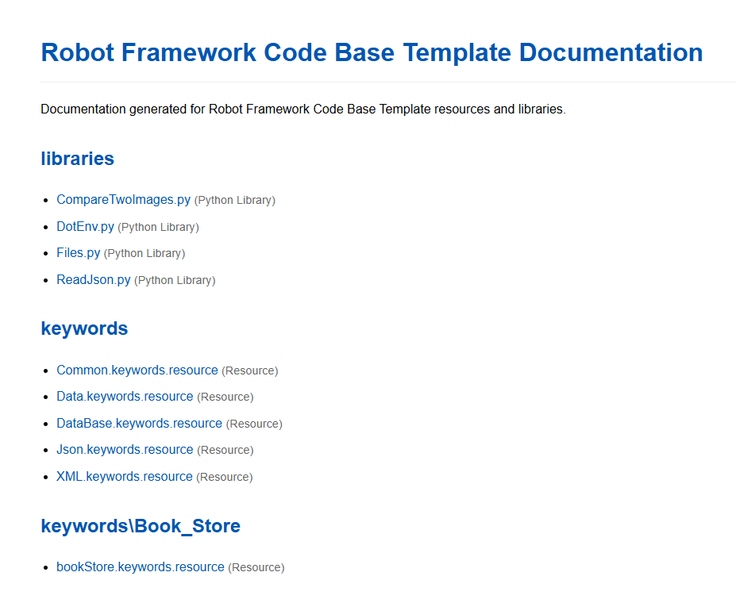
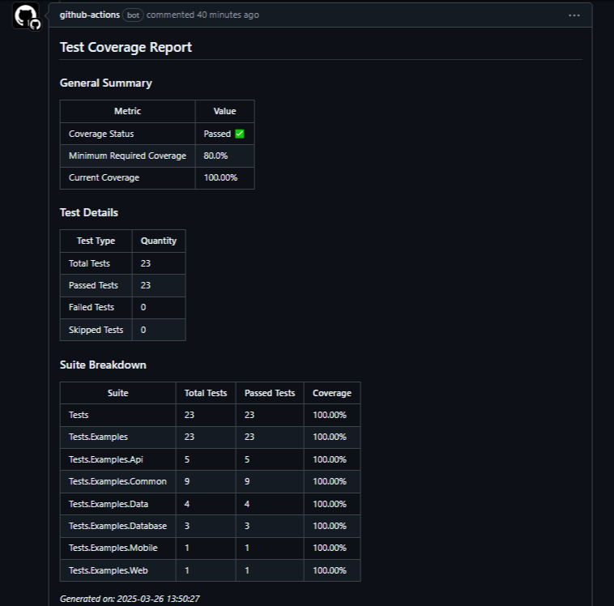

# Robot Framework Test Automation Template

## 🚀 Project Overview

This comprehensive test automation framework leverages Robot Framework to streamline end-to-end testing across multiple environments, providing a robust and flexible testing solution.

## 📋 Prerequisites

### System Requirements
- [Python™](https://www.python.org/downloads/) (3.8+)
- [Node.js®](https://nodejs.org/en/download/) (14+)

### Recommended Development Environment
- Python 3.10 or later
- Node.js 18 or later

## 🛠 Setup and Installation

### 1. Clone the Repository
```bash
git clone https://github.com/RafaelFerSilva/robot_framework_code_base_template.git
cd robot_framework_code_base_template
```

### 2. Create Virtual Environment
```bash
# Windows
python -m venv venv
venv\Scripts\activate

# Linux/MacOS
python3 -m venv venv
source venv/bin/activate
```

### 3. Install Dependencies
```bash
python make_install.py
```

This script will:
- Install project dependencies
- Initialize RobotFramework Browser Library
- Set up the testing environment

## 🌐 Environment Configuration

### Environment Variables
We use [python-dotenv](https://github.com/theskumar/python-dotenv) for environment variable management.

#### Environment-Specific `.env` Files
- `dev.env`
- `uat.env`
- `rc.env`
- `prod.env`

Refer to `example.env` for variable structure.

For running examples tests with database We need crete a uat.env file for example to config database for uat environment, the same for other environments (rc.env, prod.env)

    DB_NAME=testdb
    DB_USER=testuser
    DB_PASSWORD=testpassword
    DB_HOST=localhost
    DB_PORT=3306


### Configuration Variables
Configuration is managed through `resources/config_variables.py`:

```python
# Default Configuration
DB_API_MODULE_NAME = "pymysql"
BROWSER_TIMEOUT = "40"
BROWSER = "chromium"
HEADLESS = False
PIPELINE = False
ENVIRONMENT = "UAT"

URLS = {
    'DEV': 'https://demoqa.com/',
    'UAT': 'https://demoqa.com/',
    'RC': 'https://demoqa.com/',
    'PROD': 'https://demoqa.com/'
}

LANG = "pt"
MOBILE = False
DEVICE_NAME = "Nexus 5"

NEW_CONTEXT = {
    "acceptDownloads": True,
    "bypassCSP": False,
    # ... other context settings
}
```

### Runtime Configuration
Override default settings via command line:
```bash
robot -d ./reports --output output.xml \
    -v BROWSER:firefox \
    -v BROWSER_TIMEOUT:30 \
    -v HEADLESS:true \
    -v PIPELINE:true \
    -v ENVIRONMENT:DEV \
    ./tests
```

## 🔧 Framework Components

### `__init__.robot`
Executed before/after test suites, handling:
- Environment setup
- Database connections
- Global configurations

```robotframework
Suite Setup    Run Keywords
...    Set Environment Project Variables
...        pipeline=${PIPELINE}
...        environment=${ENVIRONMENT}
...        print_variables=True    AND
...    Connect to application database
Suite Teardown    Disconnect From Database
```

Here's an updated section for your README.md that explains the documentation generation feature:

## 📚 Documentation Generation

### Automatic Documentation

The project includes a script to automatically generate HTML documentation for all suite files on `/tests` directory, keyword files, resource files, and Python libraries in the `resources` directory.

### Usage

Run the documentation generator script from the project root:

```bash
python generate_docs.py
```

This script will:
- Scan all `.resource`, `.robot`, and `.py` files in the `resources` directory
- Scan all `.resource`, `.robot`, and `.py` files in the `tests` directory
- Generate HTML documentation using Robot Framework's libdoc/testdoc tools
- Create a documentation directory with the same structure as the resources directory
- Generate an index.html file with links to all documentation files

### Output

The documentation is saved in the `documentation` directory at the project root. The structure mirrors the `resources` directory structure, making it easy to navigate.

### Index Page

The index.html file provides:
- A complete listing of all documented files
- Organized sections for tests, libraries, keywords, and other resources
- File type indicators (Resource, Robot, Python Library)
- Direct links to each documentation file

### Customization

You can customize the documentation generation by modifying the `generate_docs.py` script:

- Add files to the `EXCLUDED_FILES` list to skip documentation generation for specific files
- Modify the HTML styling in the `create_index_file` function
- Change the output directory by modifying the `doc_dir` variable

### Example

After running the script, open `documentation/index.html` in your browser to view the complete documentation for your project:



The documentation provides detailed information about:
- Keywords and their arguments
- Python library methods
- Resource file variables
- Usage examples
- Return values

Project documentation example: [robot_framework_code_base_template](https://rafaelfersilva.github.io/robot_framework_code_base_template/)


# Database Configuration
Uses Docker Compose for test database:
```bash
# Start database container
docker-compose up -d
```

# 🧪 Running Tests

### Local Execution
```bash
# Standard mode
robot -d ./reports --output output.xml ./tests

# Verbose mode
robot -d ./reports --output output.xml -L TRACE ./tests

# Parallel execution
pabot --processes 4 -d ./reports --output output.xml --testlevelsplit ./tests 
```

## 📊 Test Coverage and Reporting

### Code Coverage Validation
```bash
# Basic usage
python resources/libraries/test_coverage_validator.py reports/output.xml

# Custom minimum coverage
python resources/libraries/test_coverage_validator.py reports/output.xml --min-coverage 85

# Custom report directory
python resources/libraries/test_coverage_validator.py reports/output.xml --output-dir custom_reports
```

### Continuous Integration

#### Pull Request Pipeline
- Location: `.github/workflows/pipeline_pull_request.yml`
- Validates code coverage
- Comments on pull requests



#### Push Commit Pipeline
- Location: `.github/workflows/pipeline_push.yml`
- Triggers on commits to main/develop branches

### Robot Metrics
Generate detailed test execution metrics:
```bash
# Standard report
robotmetrics --input reports/ --output output.xml

# Advanced options
robotmetrics --help
```

We create a step on pipeline_push.html to register metrics reports on githubpage. After Push to main branch we runner tests and register report.

### GitHub Page Report
[robot_framework_code_base_template](https://rafaelfersilva.github.io/robot_framework_code_base_template/)


## ⚠️ Important Notes
- Use secrets for environment variables in pipelines
- Customize database and configuration for your specific project needs

## 🤝 Contributing
Please read our [CONTRIBUTING.md](CONTRIBUTING.md) for details on our code of conduct and the process for submitting pull requests.

## 📜 License
Distributed under the MIT License. See `LICENSE` for more information.

## 📞 Contact
**Rafael Fernandes da Silva**
- Email: rafatecads@gmail.com
- LinkedIn: [Rafael Silva](https://www.linkedin.com/in/rafael-silva-8a10334b/)

**Project Link**: [robot_framework_code_base_template](https://github.com/RafaelFerSilva/robot_framework_code_base_template)